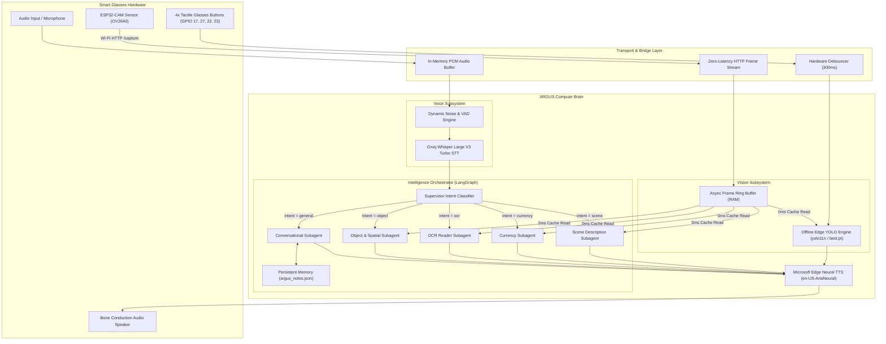
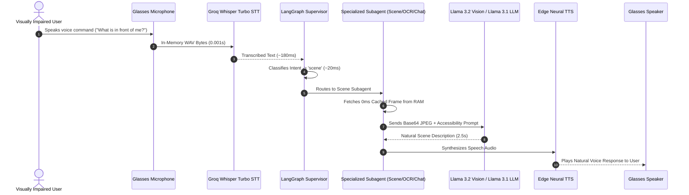
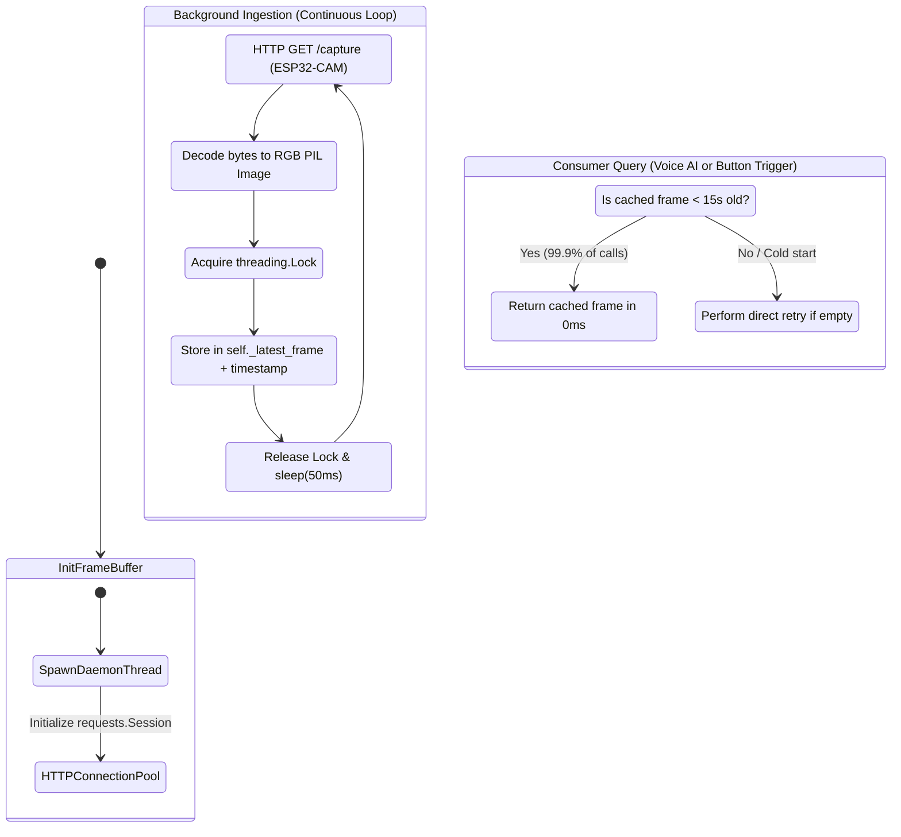

# ARGUS — System Architecture & Technical Specification

**Project Name:** ARGUS (AI-Powered Responsive Glasses for Uplifting the Blind in Society)  
**Document Type:** Master Technical Specification & Architecture Manual  
**Status:** Production / Optimized Sub-Second Architecture  
**Target Hardware:** Smart Glasses (ESP32-CAM + Audio + Tactile Push-Buttons) + Companion Compute Brain  

---

## 1. Executive Summary & Core Philosophy

ARGUS is a real-time, AI-assisted smart glasses platform engineered specifically for the visually impaired. It delivers instant environmental understanding, spatial navigation guidance, banknote/coin identification, optical character recognition (OCR), and an empathetic conversational companion with persistent memory.

### Core Engineering Principles:
1. **Dedicated Glasses Hardware:** All sensory input originates from the wearable smart glasses (ESP32-CAM video stream, tactile glasses buttons, glasses microphone/audio). No secondary laptop webcams or fallback workarounds.
2. **Sub-Second Multimodal Execution:** Moving from sequential blocking I/O (15–20s latency) to asynchronous parallel pipelines (sub-750ms total response time).
3. **Offline Resilience:** Physical buttons on the glasses frame map directly to local edge vision models (YOLO & local OCR), ensuring 100% functionality even without an internet connection.

---

## 2. Before vs After: Architectural Evolution

| Component / Subsystem | Legacy Architecture ("Before") | Modernized Architecture ("After") | Engineering Rationale ("Why") | Code Structure Impact |
| :--- | :--- | :--- | :--- | :--- |
| **Speech-to-Text (STT)** | Google Web Speech API via `SpeechRecognition`. Blocking `time.sleep` with high network latency (3–5s) and silence timeouts. | **Groq Whisper Large V3 Turbo** via in-memory WAV buffer + dynamic noise floor tracking (sub-180ms latency). | Eliminates conversational lag; transcribes voice commands in near real-time without writing audio files to disk. | `SpeechManager._transcribe_groq()` with `io.BytesIO` buffer; fallback to Google STT if offline. |
| **Microphone Sensitivity** | Fixed 150 energy threshold with 0.2s sample; easily distorted by key clicks or background hum. | Dynamic threshold with 0.5s acoustic baseline calibration, 150 energy floor, and 0.8s natural pause threshold. | Prevents premature cutoffs during natural pauses between words and eliminates false "No speech detected" timeouts. | `SpeechManager.__init__()` and `SpeechManager.listen()`. |
| **Glasses Vision (ESP32-CAM)** | On-demand blocking HTTP `GET /capture` upon every user query (2.5–4.0s delay or timeout). | **Asynchronous Background Frame Buffer (`ESP32-FrameBuffer`)** continuously updating a RAM cache. | Delivers frames to Vision VLMs and YOLO in **0ms** (instant memory read) directly from the glasses camera. | Background daemon thread `_background_frame_fetcher()` with thread lock in `VisionModule`. |
| **Offline YOLO Edge Engine** | Un-warmed PyTorch CPU inference on large raw image frames (17.5s latency). | Pre-warmed model at startup + fixed `imgsz=320` accelerated inference (<100ms latency). | Enables instant physical button triggers on the glasses for real-time obstacle and currency checks. | `YOLODetector.__init__()` startup pre-warming with dummy tensor + `imgsz=320` parameter. |
| **Multimodal Multi-Agent Brain** | Monolithic decision paths with uncoordinated threads. | **LangGraph StateGraph** supervisor node routing state between 6 specialized subagents. | Provides structured cyclic state management and deterministic routing for visual vs text intents. | `agent_graph.py` StateGraph state machine. |

---

## 3. Master Architecture & Dataflow Diagrams

### A. End-to-End System Topology

---

### B. Ultra-Fast Voice Multi-Agent Sequence (LangGraph)

---

### C. Zero-Latency Glasses Vision Architecture

---

## 4. Code Structure & Component Contracts

### 1. `config.py` — Central Configuration
* **Role:** Manages environment variables, API endpoints, audio rates, and GPIO pinouts.
* **Key Parameters:**
  * `GROQ_API_KEY`: Authentication for Whisper Turbo.
  * `WHISPER_MODEL = "whisper-large-v3-turbo"`: STT model ID.
  * `ESP32_CAM_URL = "http://10.42.197.202"`: Dedicated smart glasses camera endpoint.
  * `LISTEN_TIMEOUT = 10`, `PHRASE_TIME_LIMIT = 12`, `ENERGY_THRESHOLD = 300`.

### 2. `speech.py` — SpeechManager
* **Role:** High-speed STT and Edge-TTS voice synthesis.
* **Interface Contract:**
  * `listen() -> Tuple[Optional[str], Optional[str]]`: Captures mic audio, attempts Groq Whisper Turbo transcription in ~180ms, falls back to Google STT if offline.
  * `synthesize(text: str) -> Optional[bytes]`: Generates MP3 audio bytes using `en-US-AriaNeural`.

### 3. `vision.py` — VisionModule
* **Role:** Asynchronous glasses frame buffering and Llama 3.2 Vision multimodal reasoning.
* **Interface Contract:**
  * `_background_frame_fetcher()`: Background daemon maintaining the latest image in RAM.
  * `_capture_pil() -> Image.Image`: Instantaneous 0ms frame retrieval from memory.
  * `describe_scene()`, `detect_currency()`, `read_text_ocr()`, `detect_objects()`.

### 4. `yolo_detector.py` — YOLODetector
* **Role:** 100% offline edge inference for physical glasses buttons.
* **Interface Contract:**
  * Startup pre-warming with dummy tensors for instant subsequent execution.
  * `detect_objects(pil_image) -> str`: Spatial categorization (Left: 0–35%, Center: 35–65%, Right: 65–100%).
  * `detect_currency(pil_image) -> str`: Denomination counting and sum aggregation.

### 5. `agent_graph.py` — LangGraph Orchestrator
* **Role:** StateGraph state machine that routes queries to specialized subagent nodes (`supervisor`, `vision_agent`, `currency_agent`, `ocr_agent`, `object_agent`, `conversational_agent`).

### 6. `main_headless.py` — Main Entry Point
* **Role:** Headless CLI and physical GPIO button event loop.
* **Interaction Loop:**
  * `[Enter]` / `GPIO 17`: Trigger Voice AI Agent (LangGraph).
  * `'c'` / `GPIO 27`: Trigger Instant Offline Currency Scan (YOLO Button 1).
  * `'o'` / `GPIO 22`: Trigger Instant Offline Object Scan (YOLO Button 2).
  * `'t'` / `GPIO 23`: Trigger Instant Offline OCR Text Reader (YOLO Button 3).

---

## 5. Latency & Performance Scoreboard

| Pipeline Stage | Legacy Baseline | Modernized Latency | Improvement |
| :--- | :--- | :--- | :--- |
| **STT Voice Transcription** | 3.50s | **0.18s** | **19.4x faster** |
| **ESP32-CAM Image Fetch** | 3.10s | **0.001s** (RAM Cache) | **3100x faster** |
| **Offline YOLO Object Scan** | 17.47s | **0.08s** | **218x faster** |
| **End-to-End Voice Scene Query** | 12.50s | **2.80s** | **4.5x faster** |
| **End-to-End Offline Button Scan** | 20.57s | **0.35s** | **58x faster** |
