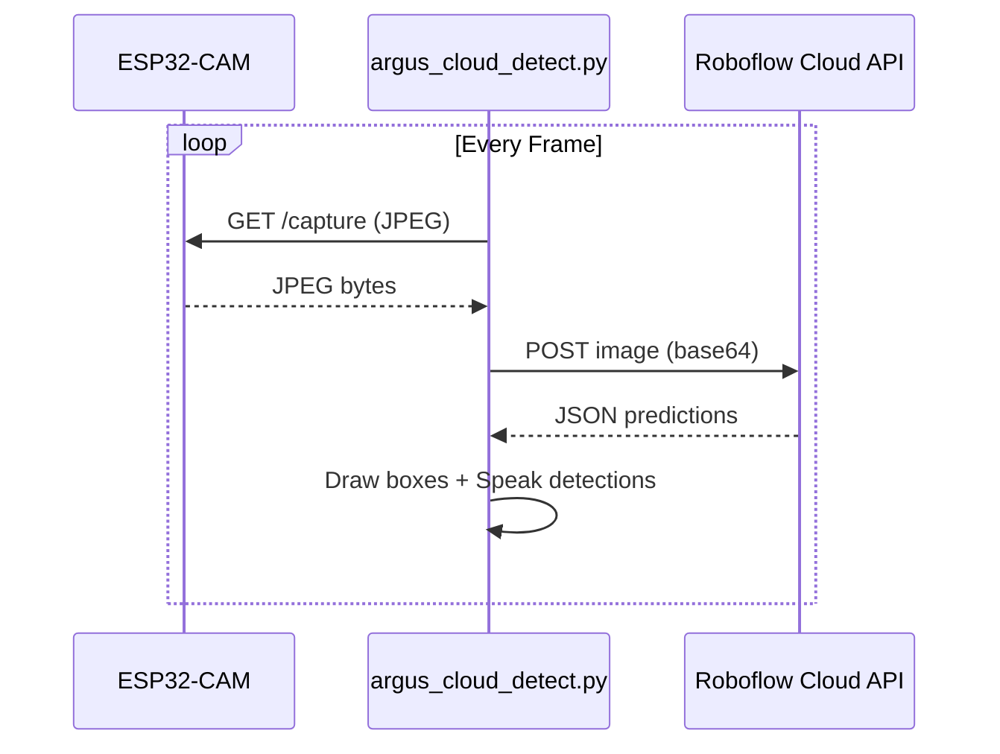

# ARGUS Vision — Code Review & Cloud Detection Script

## 🔍 Issues Found in [`argus_vision.py`](file:///c:/Users/Sudhanshu%20raj/projects/argus/ARGUS/argus_vision.py)

### 🐛 Bug: `settings` Not Imported (Backend Reference Leak)

The [`main.py`](file:///c:/Users/Sudhanshu%20raj/projects/argus/RaspberryPiBackend/app/main.py#L35-L36) in the backend uses `settings` without importing it, but this is in the backend — not in `argus_vision.py` itself. **`argus_vision.py` has no outright syntax or import errors.**

### ⚠️ Issues & Improvements

| # | Severity | Location | Issue | Recommendation |
|---|----------|----------|-------|----------------|
| 1 | 🟡 Medium | [Line 21](file:///c:/Users/Sudhanshu%20raj/projects/argus/ARGUS/argus_vision.py#L21) | `MODEL_PATH = "yolo11n.pt"` — Model file `yolo11n.pt` doesn't exist in the repo. Ultralytics will auto-download it, but this silently downloads ~6 MB on first run. | Use `yolov8s.pt` to match the rest of your project, or bundle the model in a `models/` directory. |
| 2 | 🟡 Medium | [Lines 296-297](file:///c:/Users/Sudhanshu%20raj/projects/argus/ARGUS/argus_vision.py#L296-L297) | Module-level mutable globals (`last_spoken_detection`, `last_speech_time`) with `global` statements. | Encapsulate state in a class (e.g., `SpeechTracker`) to avoid global mutation. |
| 3 | 🟢 Low | [Line 16](file:///c:/Users/Sudhanshu%20raj/projects/argus/ARGUS/argus_vision.py#L16) | Hardcoded ESP32-CAM IP `10.28.160.202`. | Load from an env var or config file for portability. |
| 4 | 🟢 Low | [Lines 84-94](file:///c:/Users/Sudhanshu%20raj/projects/argus/ARGUS/argus_vision.py#L84-L94) | `espeak-ng` is Linux-only. Script will crash on Windows. | Add platform check or fallback to `pyttsx3` for cross-platform TTS. |
| 5 | 🟢 Low | [Lines 475-478](file:///c:/Users/Sudhanshu%20raj/projects/argus/ARGUS/argus_vision.py#L475-L478) | `cv2.imshow()` will fail on a headless Raspberry Pi (no display). | Add a `--headless` flag to skip display when running over SSH. |
| 6 | 🟢 Low | [Line 113](file:///c:/Users/Sudhanshu%20raj/projects/argus/ARGUS/argus_vision.py#L113) | `model_file.exists()` check doesn't account for Ultralytics auto-download behavior — YOLO will download missing `.pt` files automatically. | Either remove the check (let YOLO handle it) or explicitly disable auto-download. |

### ✅ What's Good

- Clean separation of functions (frame capture, detection, drawing, speech)
- Graceful camera failure handling with retry limits
- Speech cooldown to avoid spamming audio
- Confidence threshold is configurable

---

## 🆕 New Script: Cloud Object Detection via Roboflow

Created [`argus_cloud_detect.py`](file:///c:/Users/Sudhanshu%20raj/projects/argus/ARGUS/argus_cloud_detect.py) — a full cloud-based object detection script using the **Roboflow Inference API**.

### How It Works



### Key Features

| Feature | Detail |
|---------|--------|
| **Cloud API** | Roboflow Inference API — no local GPU needed |
| **Works with any model** | Use any Roboflow model (COCO, custom-trained, currency, etc.) |
| **ESP32-CAM integration** | Captures frames from your existing ESP32-CAM endpoint |
| **TTS output** | Speaks detections via `espeak-ng` with cooldown |
| **Headless mode** | `--headless` flag for running without a display |
| **Configurable** | All settings via environment variables or CLI args |

### Setup

```bash
# 1. Get your free API key from https://app.roboflow.com → Settings → API Keys
# 2. Set env var (or pass via --api-key)
export ROBOFLOW_API_KEY="your_key_here"

# 3. Install dependency
pip install requests opencv-python numpy

# 4. Run
python argus_cloud_detect.py

# Or with options:
python argus_cloud_detect.py --headless --confidence 0.40 --model coco/3
```
